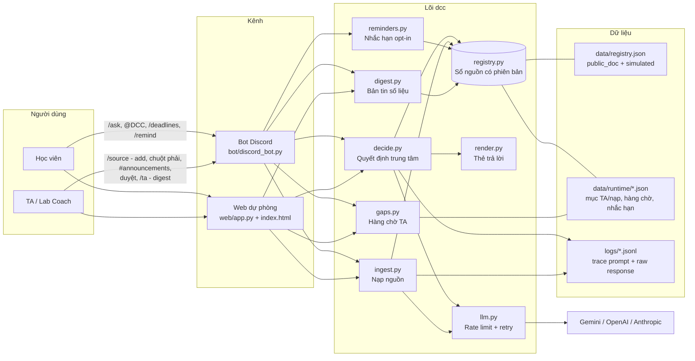
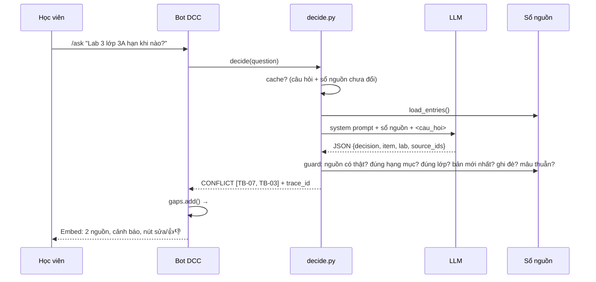
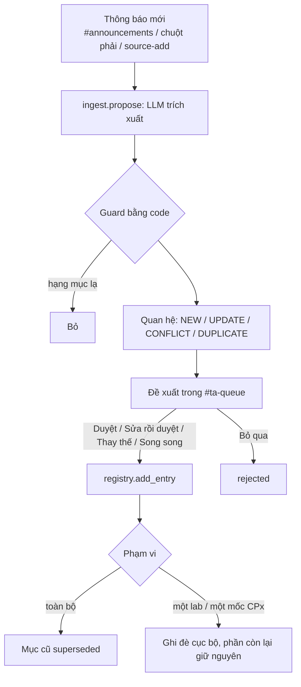

# Kiến trúc — Bot DCC

## Tổng quan hệ thống

## Luồng học viên hỏi (quyết định AI trung tâm)

## Luồng nạp nguồn (AI đề xuất, TA quyết định)

## Quyết định thiết kế

| Quyết định      | Lựa chọn                                                                                            | Lý do                                                                                                                                                    |
|-----------------|-----------------------------------------------------------------------------------------------------|----------------------------------------------------------------------------------------------------------------------------------------------------------|
| Truy xuất nguồn | Đưa toàn bộ sổ nguồn (~10–20 mục) vào prompt, **không dùng RAG/vector DB**                          | Sổ nhỏ; đưa đủ ngữ cảnh giúp LLM thấy quan hệ thay thế/mâu thuẫn giữa các mục — RAG top-k có thể bỏ sót mục mâu thuẫn. Chuyển sang RAG khi sổ > ~200 mục |
| Tin LLM đến đâu | LLM chọn quyết định + mã nguồn; **code guard kiểm tra lại**; nội dung hiển thị lấy nguyên văn từ sổ | Hai lượt eval liền LLM bỏ sót mâu thuẫn Lab 3 → guard là bắt buộc; không để LLM viết hạn nộp                                                             |
| Mức tự động hoá | Học viên: conditional · Nạp nguồn: augment (TA duyệt) · Nhắc hạn: opt-in                            | Sai hạn/nơi nộp làm mất điểm; ghi sai sổ ảnh hưởng mọi người                                                                                             |
| Framework agent | Python thuần, không LangGraph                                                                       | Luồng tuyến tính một bước quyết định; ít phụ thuộc, dễ giải thích và test                                                                                |
| Lưu trữ         | File JSON + khoá `fcntl` + ghi nguyên tử                                                            | Đủ cho demo một máy; production chuyển SQLite/PostgreSQL                                                                                                 |
| Chống quota     | Rate limit phía client, retry theo gợi ý provider, cache 10 phút theo dấu vân tay sổ nguồn          | Gemini free tier 15 request/phút                                                                                                                         |
| Giờ             | `APP_TIMEZONE=Asia/Ho_Chi_Minh`                                                                     | Hạn nộp không lệch khi chạy trên máy/server khác múi giờ                                                                                                 |
| Bảo mật web     | Thao tác TA cần `X-TA-Token` hoặc chỉ từ localhost                                                  | Không mở nút duyệt nguồn ra mạng                                                                                                                         |

## Giới hạn đã biết

- Không tích hợp vào server khoá hay bot Kute thật (không có quyền) — demo ở server test; VLearn chỉ nằm trong kế hoạch.
- Sổ nguồn gốc: 1 mục tài liệu công khai thật (lịch CP), 6 mục giả lập có gắn nhãn.
- Mục nguồn mô tả được hạng mục, lab, lớp và mốc hiệu lực, nhưng **chưa mô tả được phạm vi áp dụng theo buổi học**
  (daily standup áp dụng cho buổi build, LAB hay LEC). Vì thiếu trường này, guard không kiểm được câu hỏi kiểu đó và
  LLM tự suy — case HO07 trong `eval/heldout_results.md` vẫn trượt vì lý do này.
- Bot và web cùng ghi file có khoá, nhưng lưu trữ file không phù hợp nhiều instance.
- Free tier Gemini: dưới tải lớn request sẽ phải chờ (rate limit) thay vì lỗi.
