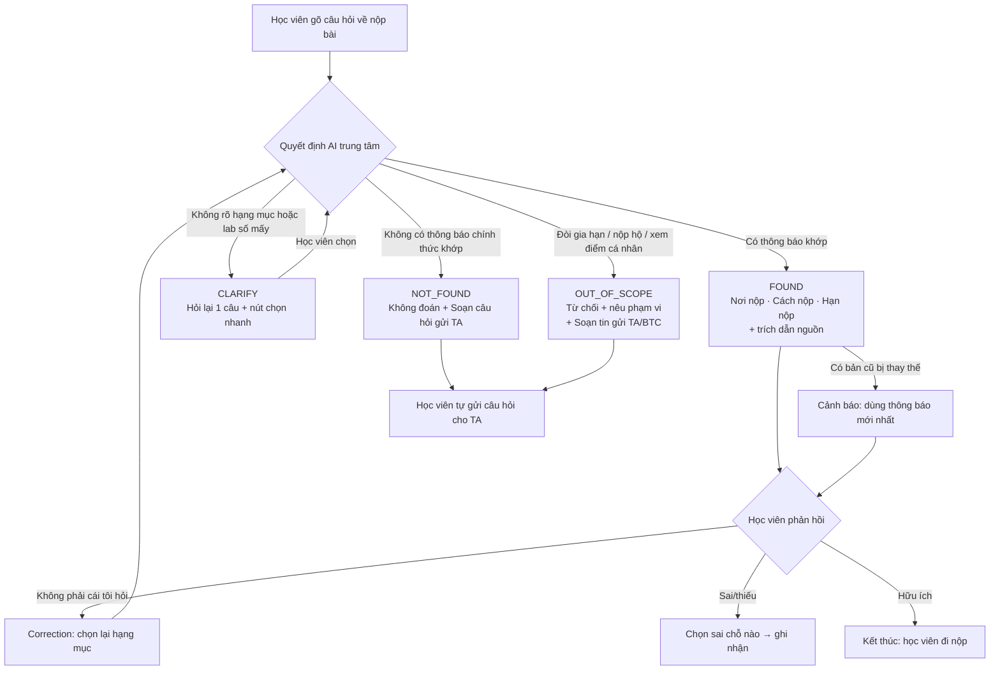

# Sơ đồ luồng — Trợ lý Nộp Bài

```mermaid
flowchart TD
    A[Học viên gõ câu hỏi về nộp bài] --> B{Quyết định AI trung tâm}
    B -->|Đòi gia hạn / nộp hộ / xem điểm cá nhân| O[OUT_OF_SCOPE<br/>Từ chối + nêu phạm vi<br/>+ Soạn tin gửi TA/BTC]
    B -->|Không rõ hạng mục hoặc lab số mấy| C[CLARIFY<br/>Hỏi lại 1 câu + nút chọn nhanh]
    C -->|Học viên chọn| B
    B -->|Không có thông báo chính thức khớp| N[NOT_FOUND<br/>Không đoán + Soạn câu hỏi gửi TA]
    B -->|Có thông báo khớp| F[FOUND<br/>Nơi nộp · Cách nộp · Hạn nộp<br/>+ trích dẫn nguồn]
    F -->|Có bản cũ bị thay thế| W[Cảnh báo: dùng thông báo mới nhất]
    F --> R{Học viên phản hồi}
    W --> R
    R -->|Không phải cái tôi hỏi| K[Correction: chọn lại hạng mục] --> B
    R -->|Sai/thiếu| G[Chọn sai chỗ nào → ghi nhận]
    R -->|Hữu ích| E[Kết thúc: học viên đi nộp]
    N --> E2[Học viên tự gửi câu hỏi cho TA]
    O --> E2
```
